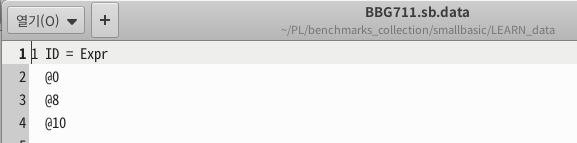
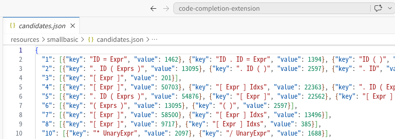
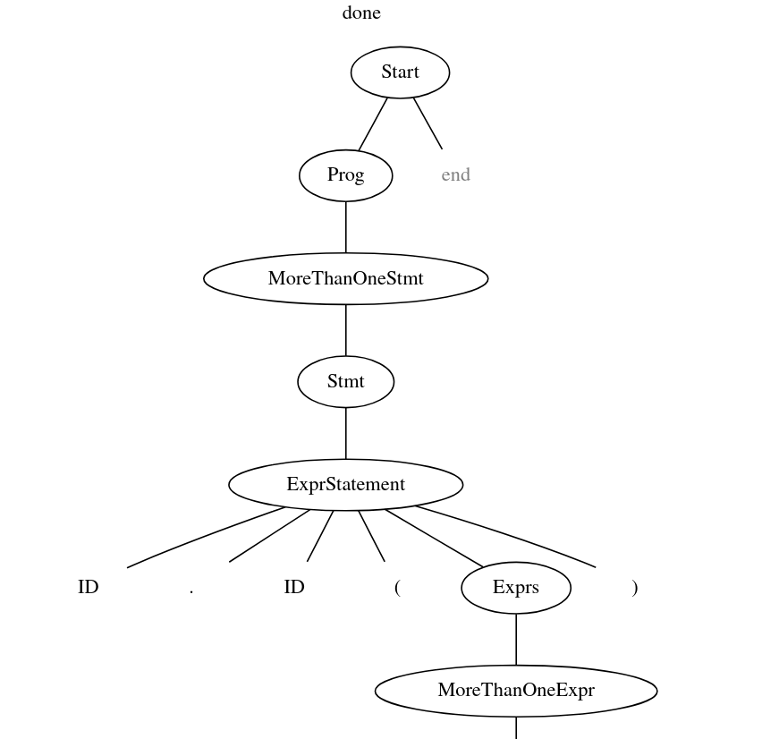
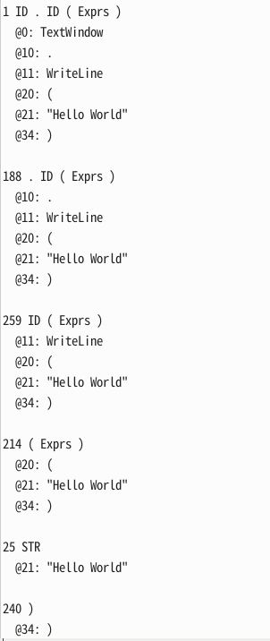

# Collection (구조후보 수집) — 설계 문서

## 1. 개요

컬렉션 (Collection) 은 코드 자동완성을 위한 **학습 데이터 생성 단계**다.
LEARN 세트의 소스 파일들을 파싱하면서, *"파서가 어떤 LR state 에 있을 때
어떤 구조후보가 등장했는가"* 를 통계로 수집한다. 결과는 `candidates.json`
형태의 DB 로 저장되어, 추후 자동완성 시점에 *"현재 state X 에서 가장 빈도
높은 구조후보가 무엇인가"* lookup 에 쓰인다.

선행 연구가 단일 LR 파싱 로그에서 구조후보를 추출한 반면, 우리는
**tree-sitter (GLR) 환경의 특수성** 때문에 다른 접근이 필요했다.

---

## 2. 입출력

**입력**
- LEARN 세트: `codecompletion_benchmarks/<lang>/LEARN/` (각 언어별)
- 언어 grammar: `tree-sitter-<lang>/<lang>.so`

**중간 산출물** (per-file)
- `Test.data` — 한 소스 파일에서 추출한 *(state, 구조후보)* 라인들

DB 구성에 필요한 state, 구조후보, byte 정보를 깔끔하게 추출하기 위해 lexeme 출력을 생략한다.


**최종 산출물**
- `candidates.json` — `code-completion-extension/resources/<lang>/candidates.json`
- 구조: `{ "<state_id>": [{"key": "<구조후보>", "value": <frequency>}, ...] }`
- 각 state 별로 그 state 에서 등장한 구조후보들의 빈도 분포


**관여 스크립트**
- `to_data_batch_collect_learn.py` — LEARN 세트 → Test.data 들
- `to_json_aggregate.py` — Test.data 들 → candidates.json (집계)

---

## 3. 알고리즘 변화 (기존 → 새 접근)

### 3.1 기존 논문 — LR 로그 순회 방식

[선행 연구](https://dl.acm.org/doi/epdf/10.1145/3605098.3635944) 는 LR 파서의 **액션 로그** (SHIFT/REDUCE/ACCEPT 시퀀스)를 순회하며 구조후보를 추출하는 방식.

- **입력**: ACCEPT 까지 성공적으로 파싱된 프로그램의 LR 액션 로그
- **출력**: `state → {구조후보 집합}` 매핑
- **핵심 가정**: 파싱이 **단일 LR 로그**로 표현됨 (모호성 없음, 에러 복구 없음)

자세한 알고리즘은 논문 Algorithm 1.

### 3.2 한계 — 현실 언어들의 모호성

기존 논문은 **C 와 smallbasic** 만 지원했다. 둘 다 *모호성 없는 grammar*
라 단일 LR 파서로 충분하지만 **현실의 대부분의 언어 (Java,
JavaScript, C++, Haskell 등) 는 모호성을 가진다**. 이를 지원하고자 우리는
**tree-sitter (GLR 파서 엔진)** 를 도입.

→ 기존 논문의 파싱이 **단일 LR 로그**로 표현된다는 핵심 가정이 깨진다.

tree-sitter 의 파싱에서는 두 가지 이유로 분기가 발생:

1. **모호성 처리 (GLR 본연)** — 여러 path 동시 탐색, 동일 state 도달 시 병합
2. **에러 복구** — GLR 메커니즘 (여러 stack version) 을 활용해 복구 path 시도

| | 일반 LR | tree-sitter |
|---|---|---|
| 모호성 처리 | 단일 path 탐색 (실패 시 종료) | **여러 path + 병합 (GLR)** |
| 에러 처리 | 파싱 실패 | **에러 복구 (분기)** |

→ 파싱 중 여러 분기의 로그가 섞이므로 기존 알고리즘의 로그 순회 방식이 직접 적용 안 됨.

### 3.3 우리의 접근 — 최종 파스 트리 순회

파싱이 끝나면 결과로 *"하나의 최종 파스 트리"* 가 남고, 이 트리는 모든
분기가 이미 해소된 *확정된 결과*. 트리시터는 트리의 노드에 parse state 등의 정보를 기록해둠. 

→ 분기 로그 대신 이 최종 트리 노드들을 순회해서 상태와 구조후보 정보를 얻자.

**예시**:

tree-sitter-smallbasic 경로에서 다음 명령어를 실행하면 log.html이 생성된다. (-D 옵션)

[tree-sitter cli 파싱 옵션](https://tree-sitter.github.io/tree-sitter/cli/parse.html)

```
tree-sitter parse -D ./SB_Sample/01_HelloWorld.sb
```



**알고리즘 핵심 아이디어**: 트리를 재귀로 순회하며, leaf 위치에 도달하면 그 형제들까지의 symbol 시퀀스를 구조후보로 기록



단, 트리시터 트리의 특성상 몇 가지 보완이 필요하다 (자세한 내용 §5). 그래도 본질은 트리 재귀.


---

## 4. 호출 흐름

```
to_data_batch_collect_learn.py <lang>          (Python)
  └─ 각 LEARN 파일에 대해 subprocess.run:
        TreeSitterCutFile.exe <lang> <lib> <file> 3
          └─ 내부적으로 ts_parser_run_collection2 호출
                └─ collect_recursive() — 트리 재귀 순회로 Test.data 출력

(모든 파일 처리 후)

to_json_aggregate.py <lang>                    (Python)
  └─ 모든 Test.data 의 라인들을 state 별 빈도로 집계
      → candidates.json
```


---

## 5. 컬렉션 알고리즘

**알고리즘 코드 위치**: `collect_recursive` (parser.c).

```
function collect_recursive(node):
    if node.is_leaf:
        advance_cursor(node)
        return

    running_state := node.parse_state                              // ①

    for i in 0..node.children.length:
        child := node.children[i]

        if child.is_leaf:                                          // ②
            emit_record(
                state   := running_state,
                symbols := [c.symbol     for c in node.children[i..]],
                offsets := [c.byte_start for c in node.children[i..]]
            )

        collect_recursive(child)

        running_state := next_state(running_state, child.symbol)   // ③
```

기본 알고리즘은 *트리 재귀 + leaf 위치에서 형제 시퀀스 기록*. 위 코드의 ①②③ 세 군데에 트리시터 트리 특성상의 보완 로직이 들어간다.

### 보완이 필요한 이유

위 ①②③ 자리에 들어가는 보완은 크게 두 가지로 나뉜다.

#### 1. state 유효성 확인

트리시터는 각 노드에 `parse_state` 를 기록한다:

- **내부 노드**: 이 노드를 shift 하기 *직전* 의 state
- **leaf 노드**: lex 시점 state (= **S1**)

`parse_state` 만으로는 부족한 두 가지 케이스:

**(a) S1 ≠ S2**

LR 파서는 토큰을 lex 한 즉시 shift 하지 않는다. lex 의 목적은 *lookahead 확보* 이고, 파서는 그 lookahead 를 보고 **먼저 reduce 가 필요한지 검사**한다. reduce 가 끝나야 비로소 그 토큰을 shift 한다:

```
파서 state X 에서 lookahead 필요
   │
   ▼  lexer 호출 → 토큰 T 등장        ← S1 = X (= leaf 노드의 parse_state 필드를 채움)
   │
   ▼  파서가 T 를 lookahead 로 사용
   │  → reduce 가 필요하면 reduce 수행 (0 회 이상 가능)
   │     state 가 Y, Z, ... 로 바뀜
   │
   ▼  더 이상 reduce 없음 → SHIFT T     ← S2 = (컬렉션에선 이 시점의 state가 필요, X와 다를 수 있음)
```

leaf 노드의 `parse_state` 는 S1 만 저장한다. 그래서 state-구조후보 기록 시 무조건 S1 만 쓰면 매핑이 어긋나는 경우가 생긴다.

**(b) fragile 노드 (sentinel 값)**

GLR 파서는 모호성을 처리하기 위해 stack 을 여러 version 으로 분기시키고, 동일 state 도달 시 재조합한다. 에러 복구도 같은 메커니즘으로 분기를 만든다. 이 *분기·재조합·에러복구의 흔적 노드들* 은 `parse_state` 가 **sentinel 값 (65535)** 으로 박힌다 (= fragile 노드). 그대로 쓰면 안 됨.

#### 2. 에러 영역 skip

GLR 에러 복구의 결과로 트리에 ERROR 노드나 missing 노드가 남는다. 이 영역의 state-구조후보 매핑은 학습 노이즈가 되므로 건너뛰도록 한다.

---

①②③ 위치별 보완 방법은 `collect_recursive` 의 인라인 주석에서 다룬다.


---

## 부록 A — Worked example: 한 internal 노드의 children 처리

for 루프와 `running_state` 동작 파악을 돕기위한 예제이다.

### 예시 트리

```
internal node X 의 children: [leaf_A, internal_B, leaf_C]
```

### Trace

```
collect_recursive(X) 진입:
  running_state = state0   (X.parse_state)

  ── iteration 1 (child = leaf_A) ──
    [C-2] emit (state0, [leaf_A.sym, internal_B.sym, leaf_C.sym])
    [C-3] recurse → leaf [A] base case (커서만 진행)
    [C-4] advance: running_state = next_state(state0, leaf_A.sym) = state1

  ── iteration 2 (child = internal_B) ──
    [C-2] emit SKIP                                            (leaf 아님)
    [C-3] recurse → collect_recursive(internal_B)
      ╭─ inner call ─────────────────────────────────╮
      │  inner running_state = internal_B.parse_state │
      │  ... internal_B 의 children 처리 ...          │
      │  (outer 의 running_state 와 *완전히 별개*)    │
      ╰───────────────────────────────────────────────╯
    [C-4] advance: running_state = next_state(state1, internal_B.sym) = state2

  ── iteration 3 (child = leaf_C) ──
    [C-2] emit (state2, [leaf_C.sym])
    [C-3] recurse → leaf [A] base case
    [C-4] advance: running_state = next_state(state2, leaf_C.sym) = state3

collect_recursive(X) 종료
```

### 포인트

1. **`running_state` 는 호출의 지역 변수** — inner call 의 state 는 outer 와 별개. 재귀는 outer 를 못 건드림.
2. **emit 은 leaf 위치에서만** — internal child 는 emit 없이 그 안에서 처리됨.
3. **emit 의 symbol 시퀀스 = 현재 leaf + 우측 형제들** — 한 emit 이 *현재 위치 + 미래 형제* 를 캡처.
4. **advance 는 매 iteration 끝에 실행** — child 종류 무관, 형제로 넘어가기 전 state 전진.