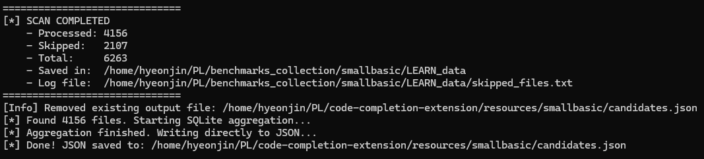
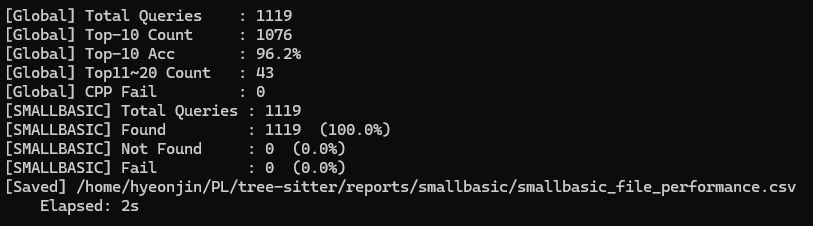

# SETUP — 설치부터 smallbasic 재현까지

## 1. 이 문서의 목표

smallbasic 1개 언어로 **LEARN → DB 구축 → TEST 평가** 전체 흐름을 직접 재현합니다.

범위 밖: VS Code extension 사용, LLM 연동

| 용어 | 뜻 |
|---|---|
| LEARN | 구조후보 DB를 만드는 학습용 소스 세트 |
| TEST | DB의 정확도를 평가하는 소스 세트 |
| 구조후보 | 특정 parse state에서 이어질 수 있는 심볼 시퀀스 |
| Top-K | 정답이 빈도 상위 K개 후보 안에 들어 있는 비율 |

<br>

## 2. 환경 세팅

Ubuntu 22.04 기준,
다음 도구가 설치되어 있어야 합니다.

- git, unzip
- gcc / g++ (C/C++ 컴파일러)
- Rust (cargo)
- Python 3
- Node.js / npm

<br>

## 3. 저장소와 데이터 배치

작업 폴더(예: `~/PL`) 아래에 다음 구조가 되도록 배치합니다.

```
~/PL/                                  ← 작업 폴더
├── tree-sitter/                       git clone, 브랜치 Candidate_Collection
├── tree-sitter-smallbasic/            git clone
├── code-completion-extension/         git clone
├── codecompletion_benchmarks/         Google Drive에서 다운로드
│   └── smallbasic/
│       ├── LEARN/                     DB 구축용 소스 (6263개)
│       └── TEST/                      평가용 소스 (27개, 모두 .sb)
└── benchmarks_collection/             스크립트가 자동 생성 (직접 만들지 않음)
```

- tree-sitter : https://github.com/SwlabTreeSitter/tree-sitter/tree/Candidate_Collection
- tree-sitter-small basic : https://github.com/chaendaya/tree-sitter-smallbasic
- codecompletion_benchmarks : https://drive.google.com/drive/folders/1MzcVv3Rjh2RO0kUzF2toZnFP_2yh1ry1?usp=sharing
- code-completion-extension : https://github.com/chaendaya/code-completion-extension

<br>

## 4. 경로 설정 (필수)

스크립트에 작성자의 경로 `/home/hyeonjin/PL`이 하드코딩되어 있습니다.
**실행 전에 자신의 환경에 맞는 프로젝트 루트 경로로 반드시 수정해야 합니다.**

현재 자신의 프로젝트 위치를 먼저 확인합니다.

```bash
cd ~/PL/tree-sitter
pwd
```

예를 들어 프로젝트 루트가 `/home/tester/PL`이라면, 기존의

```text
/home/hyeonjin/PL
```

을

```text
/home/tester/PL
```

로 변경합니다.

> **주의:** 파일마다 경로가 작성된 방식이 다릅니다.
> 어떤 파일은 `ROOT` 변수 하나만 수정하면 되지만, `evaluate_coverage.py`처럼 언어별 설정에 `/home/hyeonjin/PL/...` 경로가 직접 작성된 파일도 있습니다. 따라서 **단순히 `ROOT` 변수만 수정하지 말고, 각 파일에서 `/home/hyeonjin/PL`이 남아 있는지 반드시 확인하십시오.**

현재 경로가 올바르게 수정되었는지 다음 명령어로 확인할 수 있습니다.

```bash
grep -Rni "/home/hyeonjin/PL" \
    to_data_batch_collect_learn.py \
    to_data_batch_collect_test.py \
    to_json_aggregate.py \
    to_json_per_file_test.py \
    evaluate_coverage.py
```

**아무것도 출력되지 않으면 해당 파일들에서 기존 작성자의 경로가 모두 제거된 것입니다.**

| 구분 | 파일 |
|---|---|
| 이 문서의 절차에 필요 | `to_data_batch_collect_learn.py`, `to_data_batch_collect_test.py`, `to_json_aggregate.py`, `to_json_per_file_test.py`, `evaluate_coverage.py` |
| 리포트·보조용 | `rq1_three_metrics.py`, `plot_rank_distribution.py`, `generate_project_performance.py`, `run_evaluate_projects.py`, `count_loc.sh` |

`run_pipeline*.sh`, `rebuild_*.sh`는 수정할 필요가 없지만, §3의 폴더 배치를 전제로 합니다.


#### 파일별 수정 방법

* `to_data_batch_collect_learn.py`

* `to_data_batch_collect_test.py`

* `to_json_aggregate.py`

* `to_json_per_file_test.py`

  → `ROOT = "/home/hyeonjin/PL"`처럼 되어 있다면 **`ROOT`만 자신의 프로젝트 루트로 수정**합니다.

* `evaluate_coverage.py`

  → `LANG_CONFIGS` 내부의 `/home/hyeonjin/PL/...` 경로와 `EXE_PATH` 등 **직접 작성된 모든 경로를 자신의 프로젝트 루트에 맞게 수정**합니다.

<br>

## 5. 실행 및 결과

```bash
cd tree-sitter
./rebuild_ts_and_exe.sh                            # TreeSitterCutFile.exe 빌드 (ELF 바이너리)
./run_pipeline.sh smallbasic --learn-only          # 1. DB 구축
./run_pipeline.sh smallbasic --skip-learn-collect  # 2. TEST 평가
```

1. **DB 구축**: 도구 빌드 → LEARN Collection → `candidates.json` 생성, `code-completion-extension/resources/smallbasic`에 결과를 저장합니다.
- 콘솔 출력
  

<br>

2. **TEST 평가**: 만들어진 DB로 TEST 27개를 평가해 `reports/smallbasic/`에 결과를 저장합니다.
- 콘솔 출력 <br>
  

<br>

## 6. 주의 사항과 다른 언어

- 산출물(`candidates.json`, `reports/`)은 실행할 때마다 덮어써집니다.
- 다른 언어를 추가할 때, grammar 저장소와 벤치마크를 배치한 후 `run_pipeline.sh <언어>`로 **언어 하나씩** 진행하세요. [grammar 저장소와 벤치마크](https://github.com/SwlabTreeSitter/tree-sitter/tree/Candidate_Collection#5-%EC%A0%84%EC%B2%B4-%ED%95%B5%EC%8B%AC-%EA%B5%AC%EC%A1%B0)
- 9개 언어가 모두 준비되었을 때, `run_pipeline_all.sh`을 사용하면 모든 언어를 병렬 실행해 빠르게 진행할 수 있습니다. [스크립트 구조](https://github.com/SwlabTreeSitter/tree-sitter/blob/Candidate_Collection/SCRIPTS.md#1-%EC%98%A4%EC%BC%80%EC%8A%A4%ED%8A%B8%EB%A0%88%EC%9D%B4%ED%84%B0-shell-4%EA%B0%9C)
